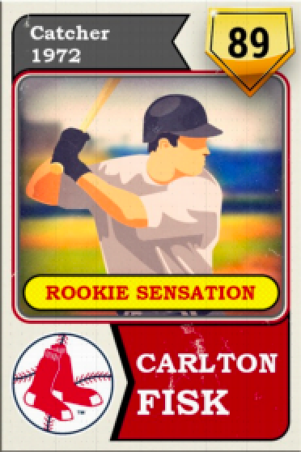
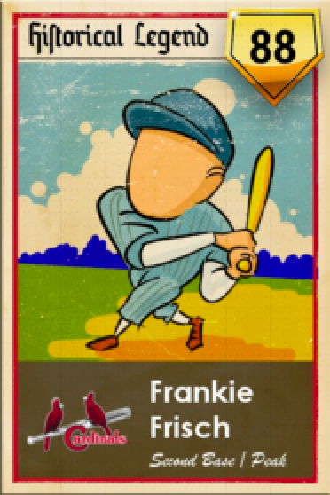
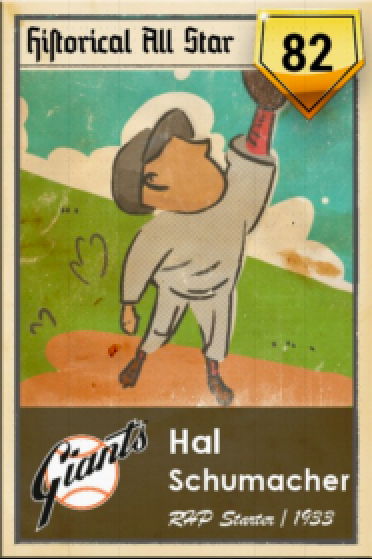
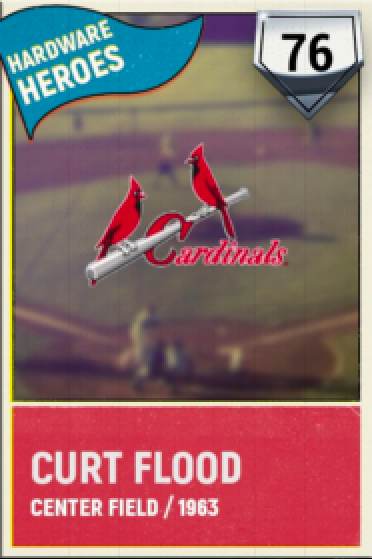

# All Stars

The sample app for the upcoming [raywenderlich.com](https://raywenderlich.com) tutorial **Getting Started with GRDB**.

### TODO

- [ ] Add app icon. Use the [MiLB First Pitch](https://apps.apple.com/us/app/milb-first-pitch/id508217833) app for inspiration
- [ ] Add card templates for each of the available categories
  - [ ] Rookie Sensation
  - [ ] All Time Legend
  - [ ] Historical All-Star
  - [ ] Record Breaker
  - [ ] Future Legend
  - [ ] Special Edition

Use the following for inspiration (taken from [OOTP 20: Perfect Team](https://www.ootpdevelopments.com/out-of-the-park-baseball-home/))

Carlton Fisk|Frankie Frisch|Hal Schumacher|Curt Flood 
-|-|-|-
 |  | | 